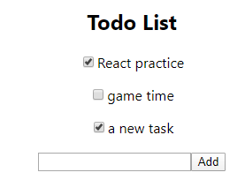

## ListItem文件

```
import React, {Component} from 'react';
import './ListItem.css'

const ListItem = (props) => {
    const item = props.item;

    
    if(item.done) {
        return <p class="item"><input type="checkbox" checked="checked" />{item.content}</p>
    }else {
        return <p class="item"><input type="checkbox" />{item.content}</p>
    }
}  

export default ListItem;
```

* 引入```<input type="checkbox">```，当done为true时，checked属性为checked，否则默认为unchecked——满足区分已完成和未完成事项的作业要求。

* 新加入任务时可以将未完成手动标记为已完成——满足可以将未完成标记为已完成的作业要求。

<div align=center></div>